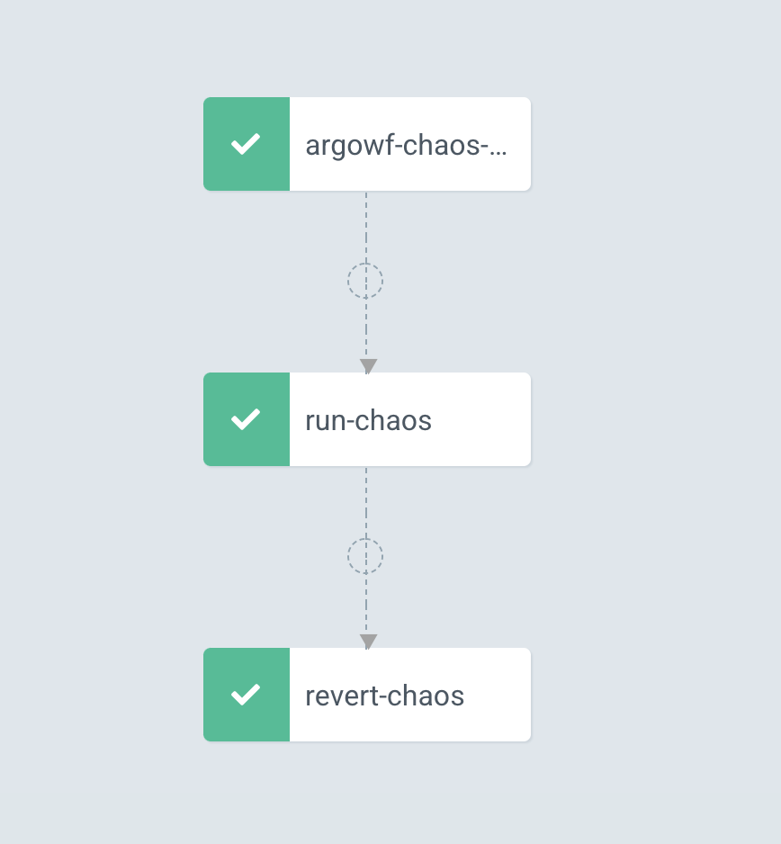

# chaos-workflows
Argo integration with LitmusChaos to create Chaos Workflows

# Pre Req 
* We assume you are using kubernetes cluster and have access to namespace with right permission

## Argo Work Flow 
* Please refer the link `https://github.com/argoproj/argo/tree/master/manifests` for Argo installtion
### Validation 
* Validate the litmus installation via below 
* export KUBECONFIG `export KUBECONFIG=/Users/<>/.kube/<your kubeconfig>`
* Verify CRDS - `kubectl get crds | grep argo`
* Validate api-resource created - `kubectl api-resources | grep argo`

## Litmus
* Please refer the link `https://github.com/litmuschaos/chaos-operator/blob/master/README.md` for Litmus installation

### Validation 
* Validate the litmus installation via below 
* export KUBECONFIG `export KUBECONFIG=/Users/<>/.kube/<your kubeconfig>`
* Validate opertor - `kubectl get pods -n litmus`
* Verify CRDS - `kubectl get crds | grep chaos`
* Validate api-resource created - `kubectl api-resources | grep litmus`

# Application  
* Go to App folder and install nginx, service and ingress based of your kubernetes setuo
* `kubectl apply -f nginx.yaml`
* `kubectl apply -f service.yaml` [ Optional]
* `kubectl apply -f ingress.yaml` [ Optional]

# Chaos 

## ChaosToolkit Experiment
* Please refer the link to install the chaostoolkit experiment `https://hub.litmuschaos.io/charts/chaostoolkit` 
* Follow detail steps after `https://github.com/litmuschaos/chaos-charts/blob/master/charts/chaostoolkit/Readme.md` 
* You have to checkout the chaos-charts `https://github.com/litmuschaos/chaos-charts/tree/master/charts/chaostoolkit`
* After you have the code 

## In Namespace Changes - Service use case
* This use case assume you want to execute the chaos pod in same namespace
* Apply experiments for k8 - `kubectl apply -f experiments.yaml`
* Validate the experiments for k8 - `kubectl get chaosexperiment`
* Setup RBAC - for pod delete RBAC - `kubectl apply -f rbac.yaml`
* Create pod Experiment - for health experiment -`kubectl create -f engine.yaml`
* Validate experiment - `kubectl get pods -w`
* Validate logs - `kubectl logs -f <delete pod>`
* Clean up chaosexperiment -`kubectl delete -f engine.yaml`
* Clean up rbac  -`kubectl delete -f rbac.yaml`

## Remote namespace - Admin use case
* This use case assume you want to execute the chaos pod in different namespace
* Apply experiments for K8 - `kubectl apply -f experiments.yaml`
* Validate the experiments for k8 - `kubectl get chaosexperiments`
* Setup RBAC as admin mode - `kubectl apply -f rbac-admin.yaml`
* Create pod Experiment - for health experiment -`kubectl create -f engine-kiam.yaml`
* Validate experiment - `kubectl get pods -w`
* Validate logs - `kubectl logs -f <delete pod>`
* Clean up chaosexperiment -`kubectl delete -f engine-kiam.yaml`
* Clean up rbac  -`kubectl delete -f rbac-admin.yaml`

# Argo

* Please install argo cmdline mentioned above on Pre-req
* Setup the argo user service account, cluster role and role binding 
* Go to Argo folder and execute `kubectl apply -f argo-access.yaml`
* Validate the user exists `kubectl get sa`

## Argo Execution
* Validate you have argo setup ` argo list` 

### In Namespace Changes - Service use case
* Argo submit will bring to state, it will add role and delete it after the execution
* You can pass command line arguments to override values
* Execute `argo submit argo-chaos.yaml`
* Validate via `argo watch <argo pod>`

### Remote namespace - Admin use case
* Argo submit will bring to state, it will add role and delete it after the execution
* You can pass command line arguments to override values
* Execute `argo submit argo-chaos-admin.yaml`
* Validate via `argo watch <argo pod>`

